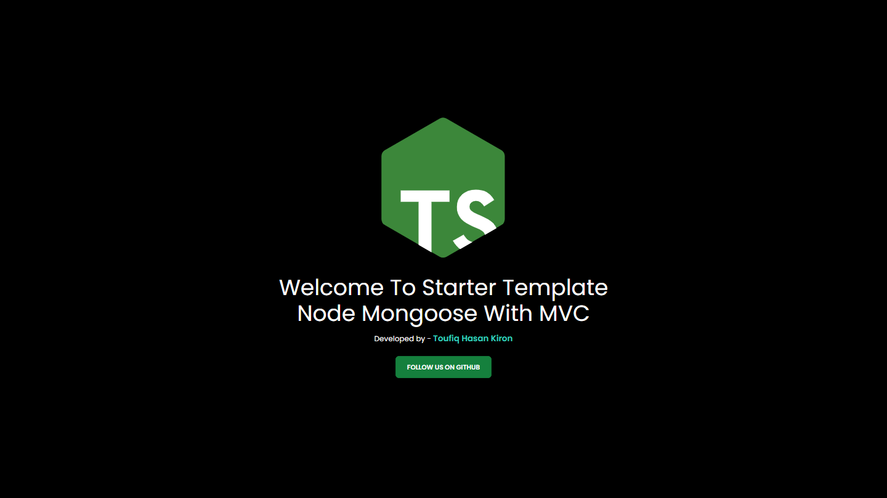
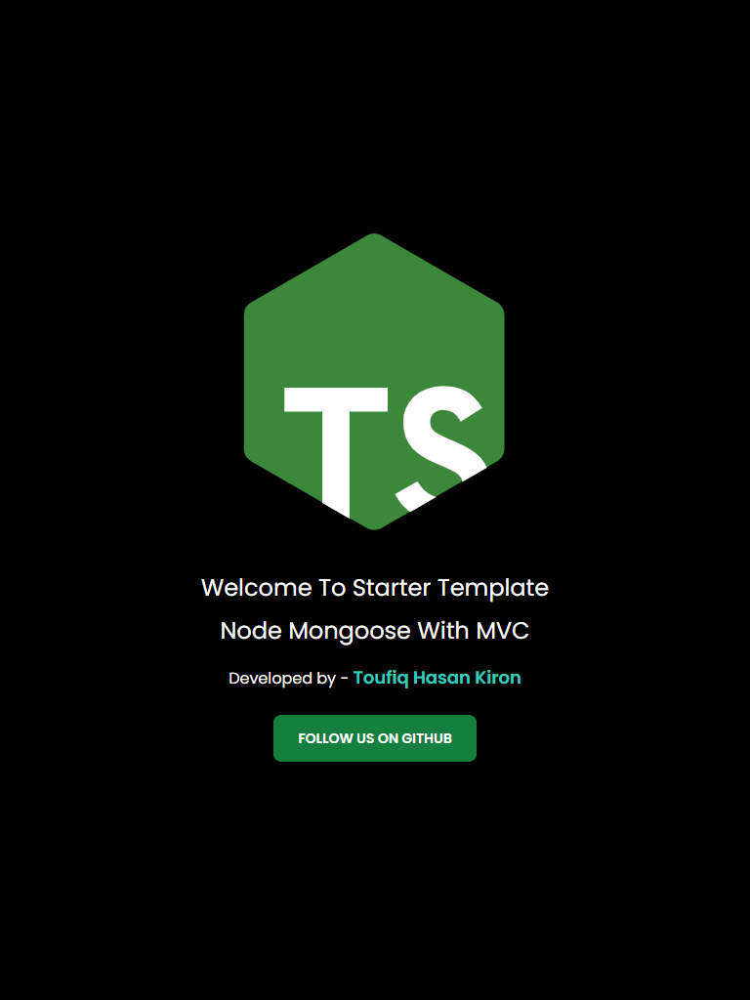
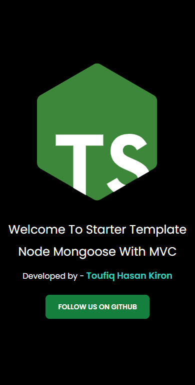

> ## Starter Template for Node-Mongoose with Typescript

> Installation

- Clone the repo

```bash
git clone https://github.com/thkSoftwares/mongoose-starter.git
```

> Dependencies
- `Node-Mongoose with Typescript` requires `node` and `yarn` to be installed on your system.

> Usage

- Run `yarn`
- Add `.env` file to the root of the project
  - Add `MONGO_URI` to the `.env` file
- Run `yarn dev` to start the server
- Run `yarn build` to build the project
- Run `yarn start` to start the project
- Open the browser and go to `localhost:8000`

> Features
> Just install the dependencies and you are good to go.

- Make a Schema
- Make a Model
- Make a Controller
- Make a Route
- Make a Service
- Make a Middleware

Then add the route to the `routes/test.ts` file & define the controller in the `controllers/test.ts` file.

Import the route in the `app.ts` file. Like,

`import testRoute from "./routes/v1/test"`

Then Call the route in the `app.ts` file. Like,

`app.use("/api/v1/test", testRoute) `
<br/><br/>

> ## Preview (Large)
<br/>



<br/>

> ## Preview (Tablet)
<br/>



<br/>

> ## Preview (Mobile)
<br/>




> ## This template initially created by `Nahid Hassan Bulbul` ([0nahid](https://github.com/0nahid))